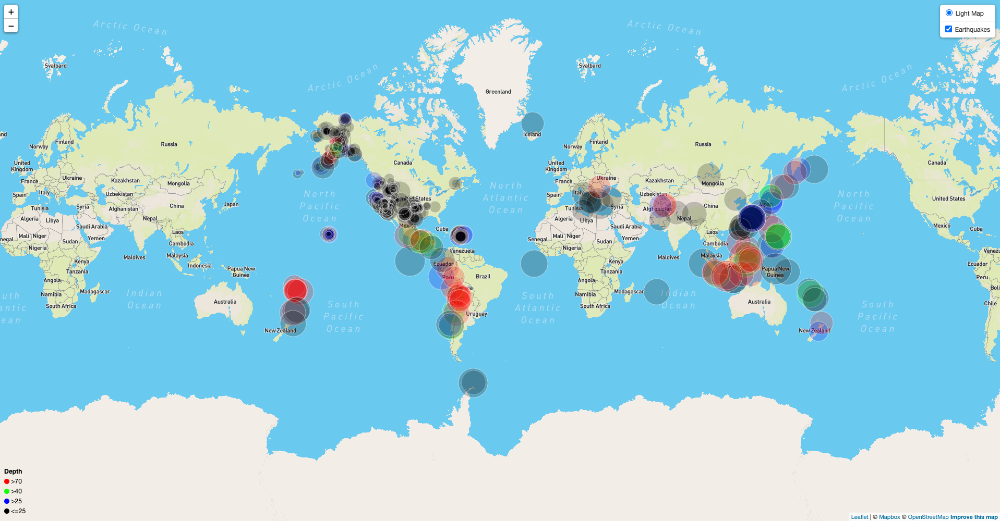

# Earthquake Mapping Visualization
The objective of this repository was to create an interactive visualization that users could explore in order to visualize earthquake data worldwide. In this visualization, the API call was made to the USGS to get data on earthquakes from the past week that are of a magnitude 1.0 or greater. The data gathered from USGS was then used to create an interactive map using Leaflet. On this map, each earthquake is represented by a circle. The bigger the radius of the circle, the larger the magnitude of the earthquake it represents. In addition to radius, the color of the circle also represents the depth of that earthquake in kilometers. In the bottom left corner of the map, one can find the legend that depicts color scheme used to represent the depths of the different earthquakes. If one clicks on one of the circles, one will be able to see a popup that reveals both the location and the magnitude of that earthqake. An example of what the interactive map looks like can be seen below.

*Note that the config file in this repository is empty in order to not publically reveal my API KEY. In order to run the visualization, you must put in your API KEY for mapbox into the config file.

